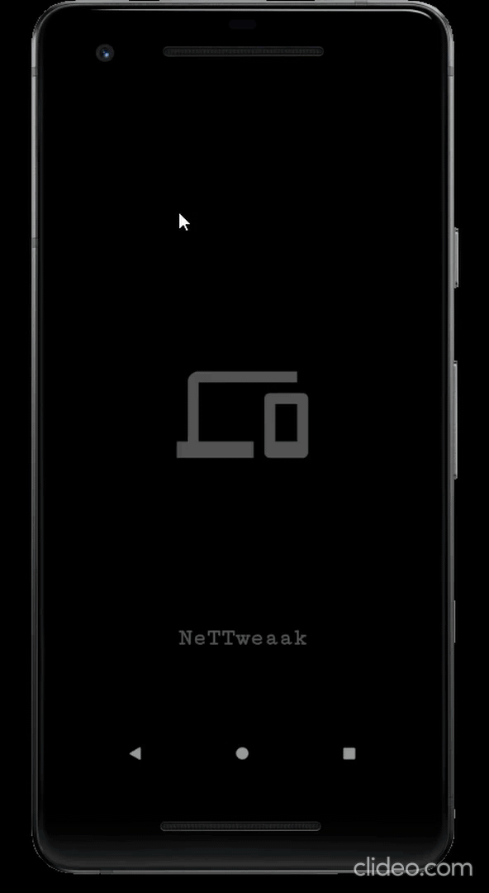
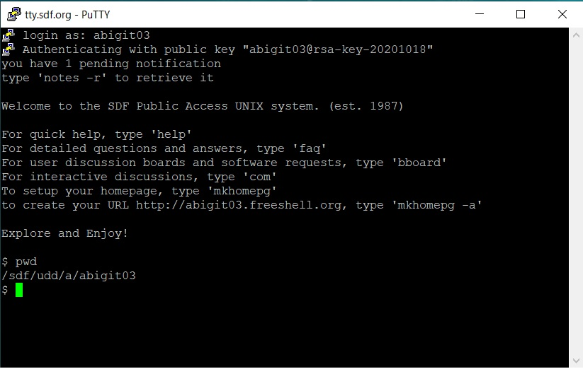

<h1 align="center">
  <br>
  <a href="https://github.com/qwerty003/Nettweak"></a>
  <br>
  Nettweak
  <br>
</h1>

<h4 align="center">A native android application to execute remote commands via SSH.</h4>

<p align="center">
  <a href="#introduction">Introduction</a> •
  <a href="#key-features">Key Features</a> •
  <a href="#installation">Installation</a> •
  <a href="#credits">Credits</a> •
  <a href="#license">License</a>
</p>




## Introduction

A native android application to execute remote commands via SSH.

The SSH protocol uses encryption to secure the connection between a client and a server. All user authentication, commands, output, and file transfers are encrypted to protect against attacks in the network. More often than not you would need to SSH into your cloud Virtual Machines or a remote shell. Usually one needs an SSH client to establish an SSH connection. For Windows, the free (libre) GUI client PuTTY is used for this purpose.

Here is a snapshot of the same remote Linux shell accessed using PuTTY.




## Key Features

* Password based authentication
* Keys based authentication *(Currently under development)*
* Command execution 
* Notification system to start shell window 
* Logs for easy debugging
* Port forwarding service *(Currently under development)*

## Installation

To clone and run this application, you'll need [Git](https://git-scm.com) and 

```bash
# Clone this repository
$ git clone https://github.com/qwerty003/nettweak

# Open directory in Android Studio
File > Open

# Dependencies
implementation 'androidx.appcompat:appcompat:1.1.0'
implementation 'com.google.android.material:material:1.1.0'
implementation 'androidx.constraintlayout:constraintlayout:1.1.3'
implementation 'androidx.navigation:navigation-fragment:2.2.2'
implementation 'androidx.navigation:navigation-ui:2.2.2'
testImplementation 'junit:junit:4.+'
androidTestImplementation 'androidx.test.ext:junit:1.1.1'
androidTestImplementation 'androidx.test.espresso:espresso-core:3.2.0'

//Adding implementations required for apache mina library
implementation 'org.apache.mina:mina-core:3.0.0-M2'
implementation 'org.apache.sshd:sshd-core:2.1.0'
implementation 'org.apache.sshd:sshd-putty:2.1.0'
implementation 'org.apache.sshd:sshd-common:2.1.0'
implementation 'org.slf4j:slf4j-api:1.7.5'
implementation 'org.slf4j:slf4j-simple:1.6.4'


# Build and run
Ctrl+F9
Shift+F10
```

## Credits

This application uses the following open source packages:

- [Apache mina-sshd](https://github.com/apache/mina-sshd)